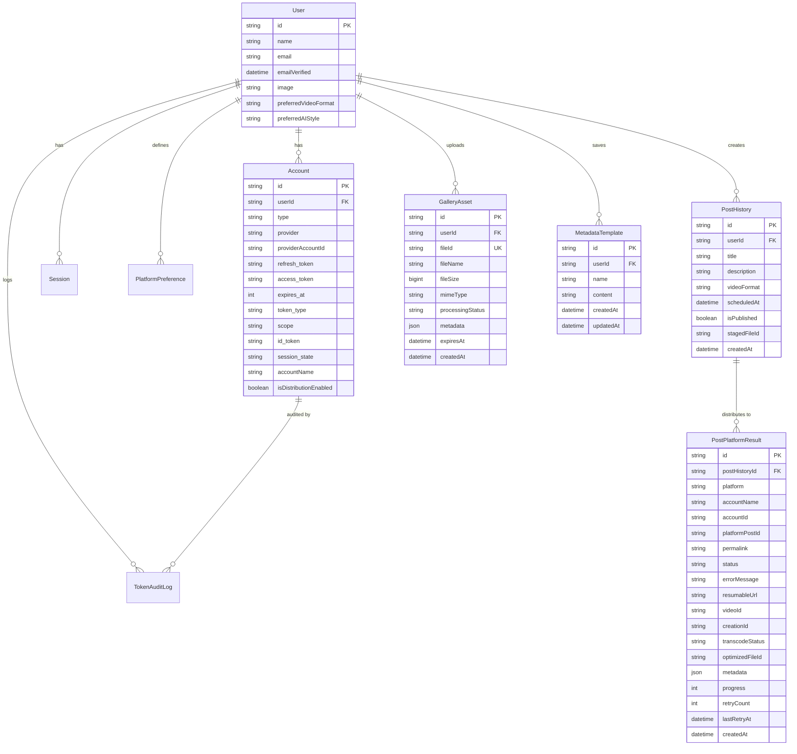
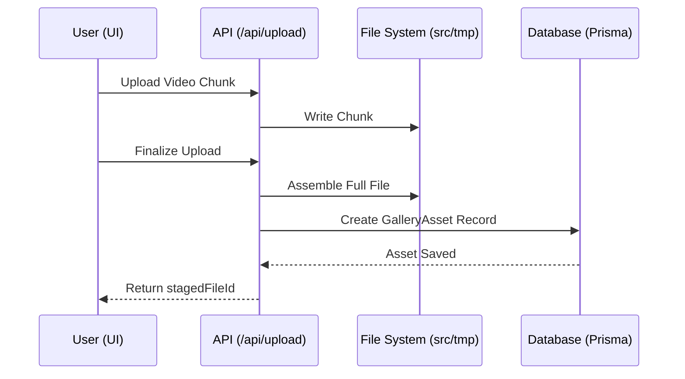
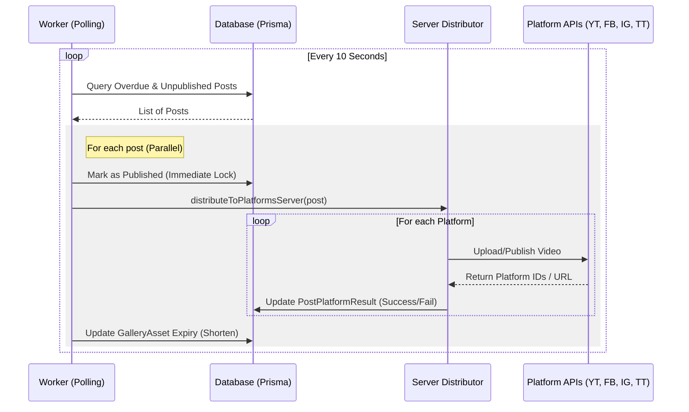
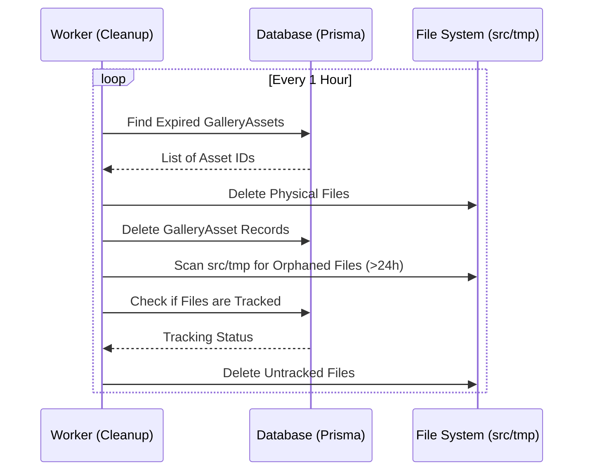

# Social Studio Architecture

This document provides a high-level overview of the Social Studio application architecture, data models, and core workflows.

## System Overview

Social Studio is a multi-platform social media management application that allows users to schedule and distribute video content (Shorts/Reels/TikToks) across various platforms simultaneously.

## Tech Stack

- **Framework:** [Next.js](https://nextjs.org/) (App Router)
- **Language:** TypeScript
- **Authentication:** [Auth.js (NextAuth)](https://authjs.dev/)
- **Database:** PostgreSQL with [Prisma ORM](https://www.prisma.io/)
- **Video Processing:** [FFmpeg](https://ffmpeg.org/) (via `fluent-ffmpeg`)
- **Mobile Wrapper:** [Capacitor](https://capacitorjs.com/) (iOS & Android)
- **Monitoring:** [Sentry](https://sentry.io/)
- **Styling:** Vanilla CSS, Framer Motion, Lucide React

## Data Model

The application uses a relational database schema managed by Prisma.

## Core Workflows

### 1. Media Upload & Ingestion

Users upload media which is temporarily stored on the server for processing and distribution.

### 2. Post Distribution (Publishing)

A background worker polls for scheduled posts and distributes them to selected platforms.

### 3. Asset Cleanup

To maintain storage efficiency, expired assets and orphaned files are purged regularly.

## Platform Integrations

Platform-specific logic is encapsulated in `src/lib/platforms/`.

- **YouTube:** Uses Google APIs Node.js client with resumable upload support.
- **Facebook/Instagram:** Uses Meta Graph API (Video/Reels endpoints).
- **TikTok:** Uses TikTok Content Posting API.
- **Local:** Simulates distribution for testing purposes.

## Mobile Architecture

The app is wrapped using **Capacitor**, allowing it to run as a native app on iOS and Android while sharing the same web codebase. Native features (camera, gallery, auth) are accessed via Capacitor plugins.

## Deployment & Infrastructure

- **Vercel:** Hosts the Next.js application and API routes.
- **PostgreSQL:** Primary data store (likely Vercel Postgres or Supabase).
- **Cloudflared:** Used for local development tunneling to test webhooks and platform callbacks.
- **Worker Process:** A separate `tsx` process (`scripts/worker.ts`) runs the background polling and cleanup logic.
