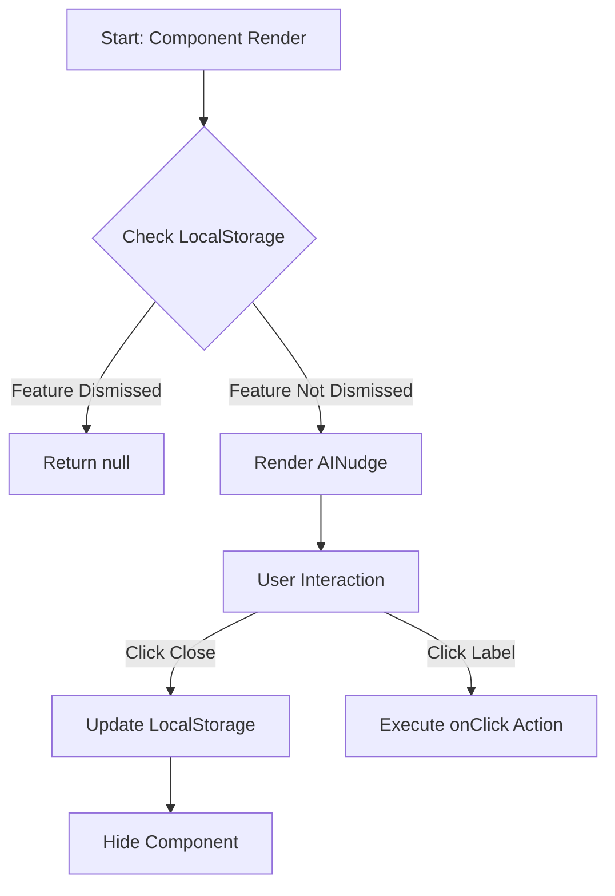

# AI Nudges

AI Nudges are subtle UI components designed to highlight AI-powered features throughout the application without interrupting the user's workflow. They are particularly useful for surfacing new or underutilized AI capabilities.

## Architecture

The `AINudge` component is a reusable UI element that persists its dismissal state in the user's browser `localStorage`. This ensures that once a user dismisses a nudge for a specific feature, it remains hidden across sessions.

### State Flow

## Component API

The `AINudge` component accepts the following props:

| Prop | Type | Description | Default |
| :--- | :--- | :--- | :--- |
| `featureKey` | `string` | Unique identifier for the feature. Used as part of the localStorage key. | (Required) |
| `message` | `string` | The text displayed in the nudge. | `"Try AI features"` |
| `tooltipText` | `string` | Text shown when hovering over the nudge. | `"Enhance your content with AI"` |
| `onClick` | `() => void` | Callback function executed when the nudge is clicked. | `undefined` |

## Visual Standards

- **Icon:** Uses the `AutoAwesomeIcon` (MUI) to signify AI capabilities.
- **Aesthetic:** Subtle background with a primary color tint, rounded corners (pill shape), and a gentle pulse animation to draw attention without being intrusive.
- **Placement:** Should be placed near the relevant feature (e.g., near an input field, button, or menu item).

## Data Persistence

Dismissal state is stored in `localStorage` using the key format:
`ai_nudge_dismissed_${featureKey}`

If `localStorage` is unavailable (e.g., private browsing), the nudge will default to being visible but won't persist its dismissed state.
