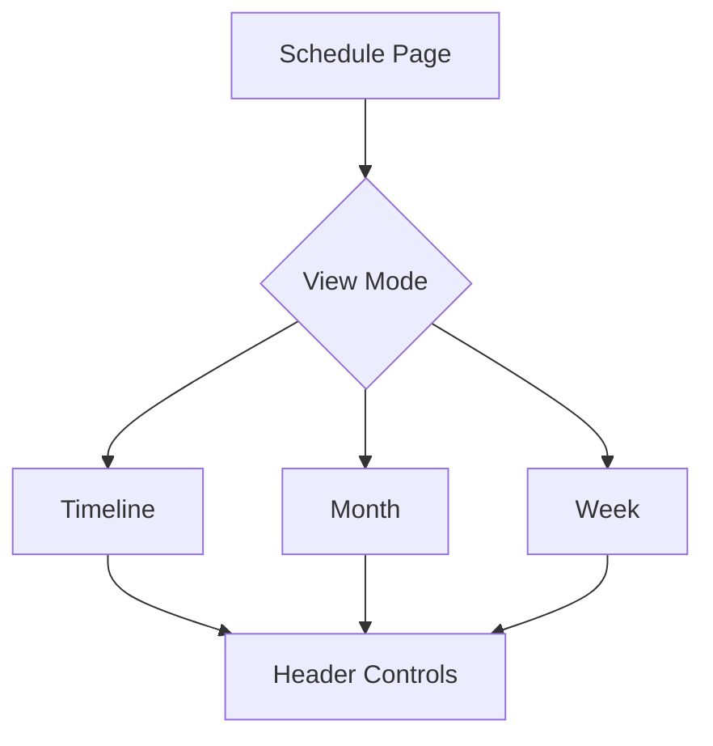

# Calendar Content Planner

## Overview
The Calendar Content Planner provides a unified scheduling environment, allowing users to visualize, manage, and plan their social media content across different time scales.

## Core Features

### 1. Unified 3-Way Toggle
Users can seamlessly switch between three distinct view modes:
- **Timeline:** A detailed, list-based view for granular task management.
- **Month:** A grid-based calendar view for long-term planning and scheduling.
- **Week:** A horizontal row-based view for mid-range campaign coordination.

### 2. Centralized Navigation
All navigation controls are located within the page-level header, ensuring consistency across view modes:
- **Period Controls:** Prev/Next arrows for time-based navigation.
- **Today Button:** Quick jump to the current date/period.
- **Active Period Label:** Clearly indicates the current focus.

## Styling & Aesthetic
- **Glassmorphism:** Deep glassmorphism layers provide a modern, depth-focused interface.
- **Visual Encoding:** Platform-specific coloring helps users quickly distinguish social media channels.
- **Responsiveness:** Fluid layouts ensure the calendar remains accessible and readable across desktop and mobile devices.

