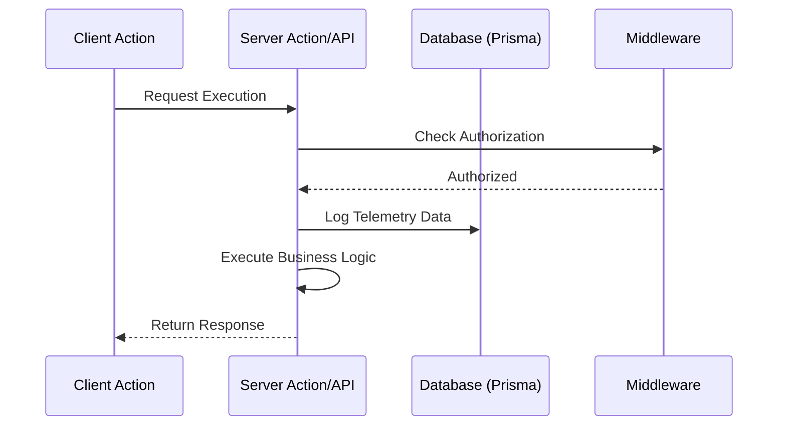

# Developer Analytics & Telemetry

The application includes a developer-focused analytics dashboard designed to monitor system health, feature adoption, and API consumption.

## Architecture

Analytics are collected through a middleware-integrated telemetry service and stored in the PostgreSQL database.



## Data Model (SystemMetric)

Analytics data is persisted using the `SystemMetric` model in `prisma/schema.prisma`.

```prisma
model SystemMetric {
  id        String   @id @default(cuid())
  event     String   // e.g., 'POST_DISTRIBUTION_SUCCESS', 'API_RATE_LIMIT_HIT'
  entityId  String?  // Associated ID (e.g., postId, userId)
  payload   Json?    // Contextual data
  createdAt DateTime @default(now())
}
```

## Features

- **Event Tracking:** Tracks critical lifecycle events (Uploads, Distributions, API failures).
- **Dashboard UI:** Provides an aggregated view of metrics for users with the `ADMIN` role.
- **Role-Based Access:** Access to the analytics route is restricted to `ADMIN` users via middleware.
- **Feature Adoption Trends:** Tracks usage across Automations and 'Manual Mode'.
- **Visual Presentation:** Charts are rendered on a white background with straight interpolation lines for clearer data interpretation.
