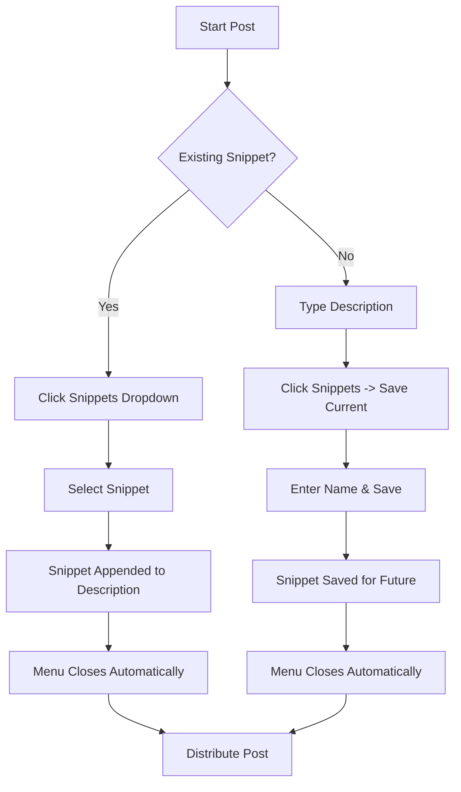

# Metadata Templates

Metadata Templates allow users to save and reuse common metadata snippets (e.g., standard descriptions, "Link in Bio" text, or credits) across multiple posts to streamline their workflow.

## Overview

Users often have repetitive text they include in every post, such as social links, attribution, or call-to-actions. Instead of manual copy-pasting, they can now save these as "Snippets" and insert them with a single click.

## Core Components

### 1. Snippet Selection (Upload Dashboard)
Located next to the description fields in the main upload form.
- **Insert:** Choose an existing snippet to append it to the current description.
- **Save:** Quickly save the current description as a new snippet for future use.

### 2. Snippet Management (Settings)
A dedicated section in the Settings page (`/settings`) for organizing saved assets.
- **List View:** See all saved snippets, their names, and content previews.
- **Update:** Edit snippet name or content.
- **Delete:** Remove outdated or redundant snippets.

## Technical Implementation

### Data Model
Managed via Prisma in `prisma/schema.prisma`:
- **Model:** `MetadataTemplate`
- **Fields:** `id`, `userId` (owner), `name`, `content` (text), `createdAt`, `updatedAt`.
- **Relationship:** Belongs to a `User` (Cascade delete).

### Server Actions
Implemented in `src/app/actions/metadata.ts`:
- `getMetadataTemplates()`: Fetches user-specific snippets.
- `createMetadataTemplate(data)`: Persists a new snippet.
- `updateMetadataTemplate(id, data)`: Modifies an existing snippet.
- `deleteMetadataTemplate(id)`: Removes a snippet (with ownership check).

### State Management & UX
Enhanced `useUploadForm` hook in `src/hooks/dashboard/useUploadForm.ts`:
- `appendDescription(val, platform?)`: Helper to intelligently append text with proper newline separation.

**Menu UX Improvements:**
- **Auto-Close:** The snippets menu automatically closes after a successful "Save" or when a snippet is "Selected" for insertion.
- **Click Outside:** The menu dismisses gracefully when clicking anywhere outside the menu container.
- **Explicit Close:** An "X" button is provided for quick dismissal.

## Quality Assurance

### Automated Testing
- **Unit Tests:** `src/__tests__/unit/metadata-actions.test.ts` covers CRUD operations and authorization.
- **Integration Tests:** Existing test suites were updated to ensure compatibility with `StyleMode` and `AITier` type changes.
- **E2E Tests (Playwright):**
    - `src/__tests__/e2e/snippets.spec.ts`: Verifies full user journey on the dashboard and UX closing logic.
    - `src/__tests__/e2e/settings.spec.ts`: Verifies template management (Edit/Delete) with hardened locators and dialog handling.
    - **Automated Auth:** Uses `src/__tests__/e2e/auth.setup.ts` to perform real logins and save session state for reuse across all E2E tests.

### Manual Verification
Refer to the following UAT scripts:
- [UAT Script: Metadata Templates](../manual_tests/verify-metadata-templates.md) (Core Flow)
- [UAT Script: Snippets UX Improvements](../manual_tests/verify-snippets-ux-improvements.md) (Targeted UX check)

## User Flow

