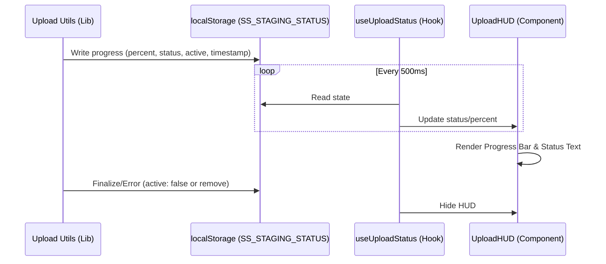

# Enhanced Upload Visibility (Upload HUD)

## Overview
The Upload HUD (Heads-Up Display) provides real-time, persistent feedback during the video upload and distribution process. It ensures users are informed of the progress of their content as it moves from their local machine to the server (Staging) and then to various social media platforms (Distribution).

## Architecture

The system uses a decentralized observation pattern where the upload utilities broadcast progress to `localStorage`, and a specialized React hook allows UI components to react to these updates without direct prop drilling or complex state management.

## Key Components

### 1. `src/lib/upload/upload-utils.ts` (Broadcast Source)
- **Staging Phase**: Uses `stageVideoFile` to upload chunks. Broadcasts percentage-based progress.
- **Distribution Phase**: Uses `distributeToPlatforms` to send the staged file to APIs (YouTube, TikTok, etc.). Supports concurrent uploads (concurrency adjusted based on file size). Broadcasts status-based progress (e.g., "Uploading to youtube...").
- **State Schema**: Broadcasts a JSON object containing `status`, `percent`, `active`, and `timestamp`.
- **Cleanup**: Removes the `SS_STAGING_STATUS` key from `localStorage` upon successful completion or fatal error.

### 2. `src/hooks/useUploadStatus.ts` (State Synchronizer)
- Polls `localStorage` every 500ms.
- Validates data using **Zod** to ensure type safety and prevent UI crashes from malformed data.
- Returns `{ status, percent, active }`.

### 3. `src/components/ui/UploadHUD.tsx` (Visual Feedback)
- A "floating" UI element fixed at the bottom of the viewport.
- **Animations**: Uses `slideUpHUD` animation for a smooth entrance.
- **Controls**: Includes a "STOP ALL" button that allows users to manually clear the upload state (effectively "cancelling" the visual tracking).
- **Aesthetic**: Material UI inspired with backdrop blur, primary color accents, and a pulse indicator.

## UI Standards
- **Currency**: All costs associated (if any) are in **PLN**.
- **Units**: File sizes and progress are in **Metric** (MB).
- **Language**: **English** only.
- **Icons**: Exclusively uses **Material UI Icons** (e.g., `StopIcon`).

## Performance Considerations
- **Polling vs Events**: Polling `localStorage` at 500ms is used for broad compatibility across tabs and to simplify the implementation. The performance impact is negligible.
- **Zod Validation**: Ensures that even if external scripts modify `localStorage`, the application remains stable.

## Error Handling
- If an upload fails, the status message updates to reflect the error before the HUD is eventually cleared or manually dismissed.
- Sentry logs are triggered in the `upload-utils` layer for any network failures.
