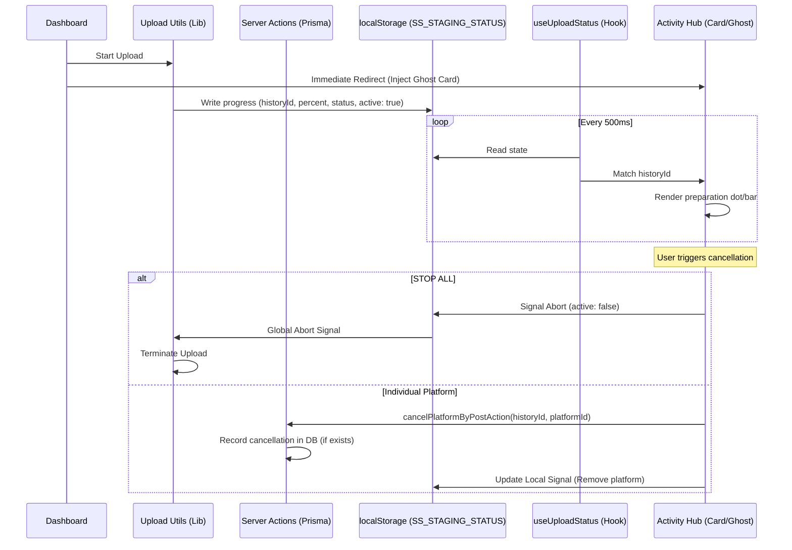

# Enhanced Upload Visibility (Activity Hub Integration)

## Overview
Enhanced Upload Visibility provides real-time, context-specific feedback during the video upload and distribution process. Instead of a global floating element or in-form progress bars, the system adopts a "Dashboard-to-Activity" flow: progress is integrated directly into individual post cards within the **Activity Hub**, and the Dashboard redirects immediately upon submission to maintain a fast, distraction-free workflow.

## Architecture

The system uses a decentralized observation and signaling pattern via `localStorage`. This allows for cross-tab synchronization and global abort signals. It also leverages server-side actions to handle cancellations of optimistic states that haven't yet reached the database.

### Data Synchronization Flow

## Key Features

### 1. Immediate Dashboard Redirect & Optimistic Ghost Card
To optimize "human-centric" design, the Dashboard no longer holds the user hostage during the staging phase. 
- **Redirect**: Once "Post Video" or "Confirm AI Strategy" is clicked, the user is immediately redirected to the Activity Hub.
- **Ghost Card**: Since the database record might take a few hundred milliseconds to propagate, an **Optimistic Ghost Card** is injected into the Activity Hub's local state. 
- **Persistence & Reconciliation**: The Ghost Card is designed to persist even across multiple polling cycles. It only disappears once a real database record with a matching `historyId` is confirmed in the fetched list.
- **Fuzzy Matching Fallback**: In cases where IDs might temporarily mismatch due to synchronization delays, the system uses "Fuzzy Matching" (comparing title and creation timestamp) to reconcile the Ghost Card with the incoming database record, ensuring a seamless visual transition.
- **Visual Continuity**: This ensures the user sees their post *instantly* upon redirection, avoiding a "Missing Data" or empty state. The Ghost Card transitions into a standard history card once the real data arrives.

### 2. Multi-Level Cancellation (Global & Granular)
The system provides total control over the upload process even after redirection.
- **STOP ALL Button**: Appears on the Ghost Card and the active History Card. Clicking this sends a global abort signal via `localStorage`, terminating all local staging and all scheduled platform distributions for that specific post.
- **Individual Platform Cancellation**: Each platform pill in an active card (both Ghost and Real) has a cancellation option. This allows users to stop a YouTube upload while letting Instagram continue.
- **Server-Side Optimistic Handling**: If a user cancels a platform on a Ghost Card (before the DB record exists), the system uses `cancelPlatformByPostAction`. This server action tracks these "pre-emptive" cancellations and ensures that if the distribution engine later starts for that post, it respects the cancellation even if the main record was late to synchronize.

### 3. Cross-Tab Abort Signaling
If a user has multiple tabs open:
- Clicking **STOP ALL** in the Activity Hub tab writes an `active: false` signal to `localStorage` for that specific `historyId`.
- The background upload process (which might be running in the original Dashboard tab or a worker) polls this signal and terminates immediately.
- The Dashboard tab observes the global abort and resets its local distribution engine.

### 4. Integrated Activity Hub Indicators
- **Processing Dot**: An animated pulsing dot appears next to the post title in the Activity Hub while any part of the process (staging or distribution) is active.
- **Universal Status Messages**: Status messages are generalized and technical (e.g., "Initializing distribution", "Preparing assets"). Chat emojis have been removed for a professional aesthetic.

## Reliability & Fixes

### Stale ID Resolution
A critical bug was fixed where background account mapping (Platform Sync) was using stale or incorrect User IDs during the staging phase. The mapping logic now strictly resolves the current authenticated user context before initiating platform-specific tokens, ensuring 100% reliability for multi-platform distribution.

## Key Components

### 1. `src/lib/upload/upload-utils.ts` (Broadcast & Signal Listener)
- **Check Global Abort**: Every chunk upload and every platform distribution step checks `checkGlobalAbort(historyId)`.
- **Staging Phase**: Broadcasts percentage-based progress to `SS_STAGING_STATUS`.
- **Distribution Phase**: Broadcasts status-based progress (e.g., "Uploading to youtube...").

### 2. `src/hooks/useUploadStatus.ts` (State Synchronizer)
- Polls `localStorage` every 500ms.
- Validates data using **Zod**.
- Returns `{ historyId, status, percent, active }`.

### 3. `src/components/dashboard/DashboardClient.tsx`
- Observes `useUploadStatus`.
- If a global `active: false` signal is detected for an ongoing local upload, it invokes `handleAbortAll()` to clean up local resources.

## UI & Aesthetic Standards
- **Zero Floating HUDs**: Floating overlays have been removed to reduce visual clutter.
- **Material UI Icons**: Exclusively uses `StopIcon`, `RocketLaunchIcon`, and `AutoAwesomeIcon`.
- **No Emojis**: Status messages use technical text (e.g., "Synchronizing cockpit state") rather than emojis.
- **Units**: File sizes and progress are in **Metric** (MB).

## Performance Considerations
- **Polling vs Events**: `localStorage` polling at 500ms provides reliable cross-tab communication without the complexity of BroadcastChannel or Service Workers, fitting the current scale of the application.

## Error Handling
- **Graceful Termination**: Aborting a request doesn't just "stop" the UI; it ensures the underlying `fetch` requests are aborted and local state is reset.
- **Persistence**: If a user refreshes the page, the `localStorage` signal ensures the Activity Hub continues to show the correct "Active" state for ongoing background tasks.
