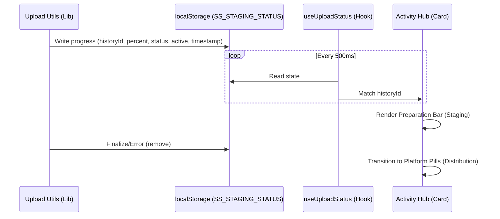

# Enhanced Upload Visibility (Activity Hub Integration)

## Overview
Enhanced Upload Visibility provides real-time, context-specific feedback during the video upload and distribution process. Instead of a global floating element, progress is integrated directly into individual post cards within the **Activity Hub**. This ensures users can track multiple concurrent or sequential uploads within their natural workflow.

## Architecture

The system uses a decentralized observation pattern where the upload utilities broadcast progress to `localStorage` keyed by `historyId`. The Activity Hub uses a specialized React hook to synchronize this local state with the database-driven timeline.

## Key Components

### 1. `src/lib/upload/upload-utils.ts` (Broadcast Source)
- **Staging Phase**: Uses `stageVideoFile` to upload chunks. Broadcasts percentage-based progress and the unique `historyId`.
- **Distribution Phase**: Uses `distributeToPlatforms` to send the staged file to APIs. Broadcasts status-based progress (e.g., "Uploading to youtube...").
- **State Schema**: Broadcasts a JSON object containing `historyId`, `status`, `percent`, `active`, and `timestamp`.
- **Cleanup**: Removes the `SS_STAGING_STATUS` key from `localStorage` upon successful completion or fatal error.

### 2. `src/hooks/useUploadStatus.ts` (State Synchronizer)
- Polls `localStorage` every 500ms.
- Validates data using **Zod** to ensure type safety.
- Returns `{ historyId, status, percent, active }`.

### 3. `src/app/history/page.tsx` (Visual Integration)
- The Activity Hub timeline identifies active staging processes by matching the `historyId` from the hook with the post's ID.
- **Preparation Bar**: A live progress bar rendered at the top of the post card during the staging/initialization phase.
- **Auto-Scroll/Focus**: When a user is redirected from the Dashboard, the relevant card highlights its active status.

## UI Standards
- **Currency**: All costs associated (if any) are in **PLN**.
- **Units**: File sizes and progress are in **Metric** (MB).
- **Language**: **English** only.
- **Icons**: Exclusively uses **Material UI Icons** (e.g., `RocketLaunchIcon`, `SettingsIcon`).

## Performance Considerations
- **Polling vs Events**: Polling `localStorage` at 500ms is used for broad compatibility across tabs and to simplify the implementation. The performance impact is negligible.
- **Zod Validation**: Ensures that even if external scripts modify `localStorage`, the application remains stable.

## Error Handling
- If an upload fails, the status message inside the card updates to reflect the error.
- Clicking **STOP ALL** on a card not only cancels the platform distribution but also clears the local staging state if the IDs match.
